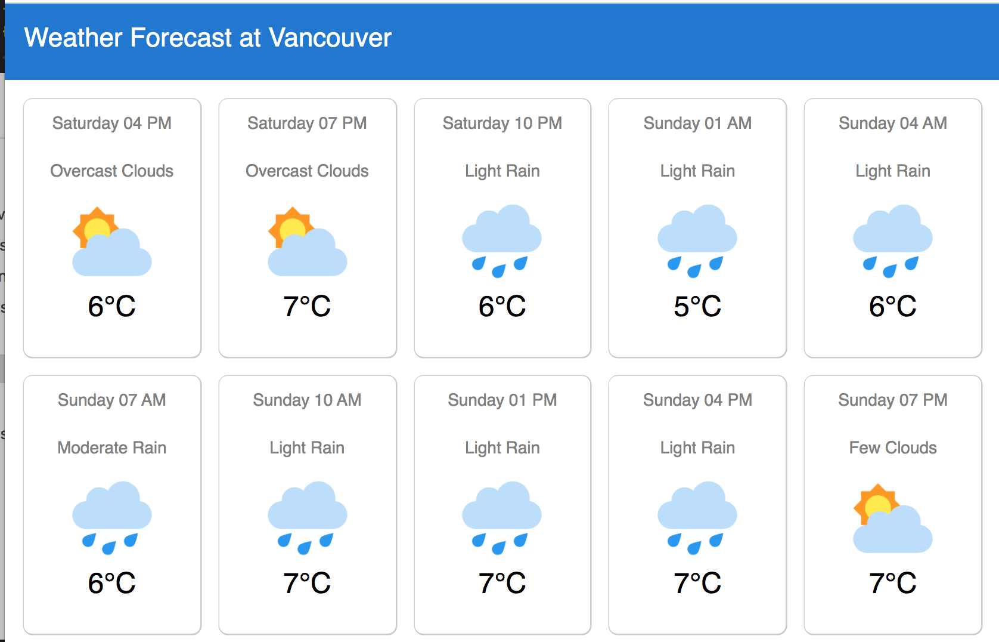

# WeatherForecastApp

A responsive web application to have a look to the Weather at Vancouver.

## Note
I used the 5 day api and I displayed 16 weather forecast by 3 hours slot. 

## Install
Run `npm install`

## Development server

Run `ng serve` for a dev server. Navigate to `http://localhost:4200/`. The app will automatically reload if you change any of the source files.

